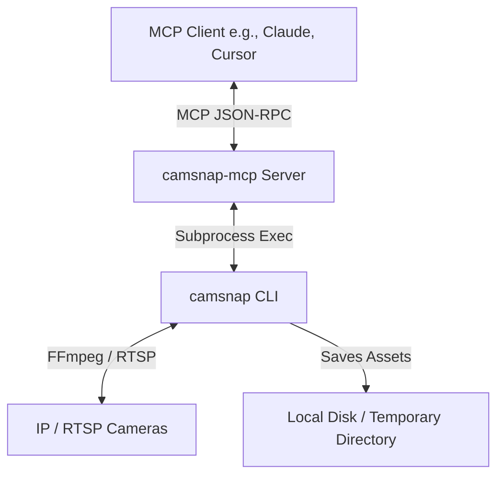

# 📸 camsnap-mcp

An MCP (Model Context Protocol) server for **camsnap** — control, capture, and analyze your IP/RTSP cameras directly from Claude Desktop, Cursor, or any MCP-compatible client.

> [!NOTE]
> This MCP server is a wrapper around the [camsnap](https://github.com/steipete/camsnap) project.



---

## 📂 Repository Structure

```
camsnap-mcp/
├── [pyproject.toml](file:///gorgon/ia/mcp_camsnap/pyproject.toml)
└── src/
    └── camsnap_mcp/
        ├── __init__.py
        └── [server.py](file:///gorgon/ia/mcp_camsnap/src/camsnap_mcp/server.py)
```

---

## 🛠️ Prerequisites

Before using this MCP server, you must have `camsnap` installed and configured on your system.

> [!IMPORTANT]
> 1. **Install camsnap**: Follow the instructions at [steipete/camsnap](https://github.com/steipete/camsnap) to install the binary and its dependencies (such as FFmpeg).
> 2. **Configure cameras**: Ensure you have a valid configuration file. By default, `camsnap` looks for it in `$XDG_CONFIG_HOME/camsnap/config.yaml` or `~/.camsnap.yaml`. You can verify your setup by running `camsnap list` in your terminal.

### Custom Configuration & Temp Paths

You can configure the server using the following environment variables:

- **`CAMSNAP_CONFIG`**: If your configuration file is in a non-standard location, specify its absolute path.
- **`CAMSNAP_TMP_DIR`**: Path to save local files (snapshots, clips). Defaults to `~/.camsnap/tmp`.
- **`CAMSNAP_RESIZE_MAX`**: Set this to a pixel value (e.g., `1024` or `768`) to automatically downscale snapshots returned inline. This helps save token usage in LLM prompts while maintaining enough detail for analysis.

---

## 🚀 Installation

Add the following to your MCP client configuration (e.g., `claude_desktop_config.json`):

```json
{
  "mcpServers": {
    "camsnap": {
      "command": "uvx",
      "args": [
        "--from",
        "git+https://github.com/mamorett/mcp_camsnap.git",
        "mcp-camsnap"
      ],
      "env": {
        "CAMSNAP_CONFIG": "/path/to/your/camsnap.yaml",
        "CAMSNAP_TMP_DIR": "/path/to/a/safe/tmp/dir",
        "CAMSNAP_RESIZE_MAX": "1024"
      }
    }
  }
}
```

> [!TIP]
> Using `uvx` automatically handles downloading and isolating the Python server. No manual `pip install` is required.

---

## 🔧 Available Tools

This MCP server exposes the following tools:

| Tool | Signature | Description | Return Type |
|---|---|---|---|
| **[list_cameras](file:///gorgon/ia/mcp_camsnap/src/camsnap_mcp/server.py#L68-L73)** | `list_cameras() -> str` | Lists all cameras configured in the camsnap config file. | `str` (List of cameras) |
| **[capture_snap](file:///gorgon/ia/mcp_camsnap/src/camsnap_mcp/server.py#L113-L170)** | `capture_snap(camera_name: str) -> Image` | Captures a snapshot and returns it inline directly to the client. | `Image` (Inline image block) |
| **[save_snap](file:///gorgon/ia/mcp_camsnap/src/camsnap_mcp/server.py#L75-L111)** | `save_snap(camera_name: str, target_path: str \| None = None) -> str` | Captures a snapshot and saves it directly to `target_path`. If not specified, saves to a timestamped file in the temp directory. | `str` (Confirmation message with path) |
| **[capture_clip](file:///gorgon/ia/mcp_camsnap/src/camsnap_mcp/server.py#L172-L200)** | `capture_clip(camera_name: str, duration: int = 10) -> str` | Records a short MP4 video clip to a temporary file and returns its absolute path on the host system. | `str` (Confirmation message with path) |
| **[capture_raw_clip](file:///gorgon/ia/mcp_camsnap/src/camsnap_mcp/server.py#L202-L248)** | `capture_raw_clip(camera_name: str, duration: int = 10) -> dict` | Records a short MP4 video clip and returns its raw binary content base64-encoded. | `dict` (MIME type and base64 string) |

---

## 💻 Local Development

If you want to run or modify the server locally:

```bash
# Clone the repository
git clone https://github.com/mamorett/mcp_camsnap
cd mcp_camsnap

# Install with development dependencies
uv pip install -e .

# Run the MCP server locally
mcp-camsnap
```
